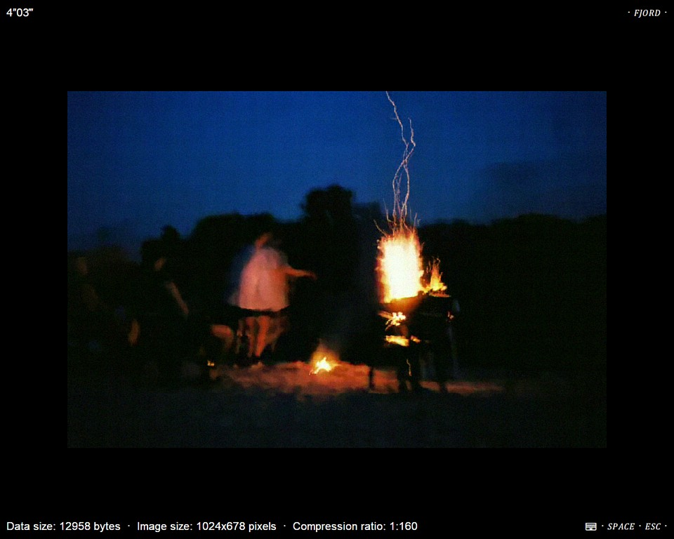

# FJORD

Fjord is a tiny Windows native application for viewing images compressed by the FJORD fractal codec (based on partitioned iterated function systems). 



## About the Project

The resulting binary takes about 12 KiB of the disk space. And even lesser, ~8 KiB, if kkrunchy-k7 EXE packer from demoscene group Farbrausch is used.

## TODO

```
- [ ] Support for platforms other than x86
- [ ] Use window function that sums in 1
- [ ] Resolve TODOs from code
